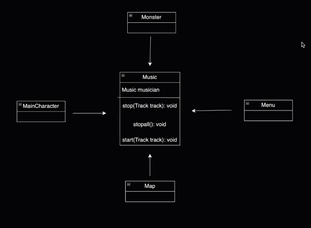
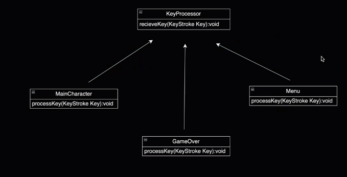
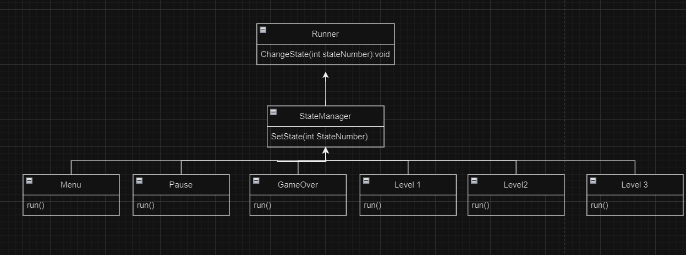
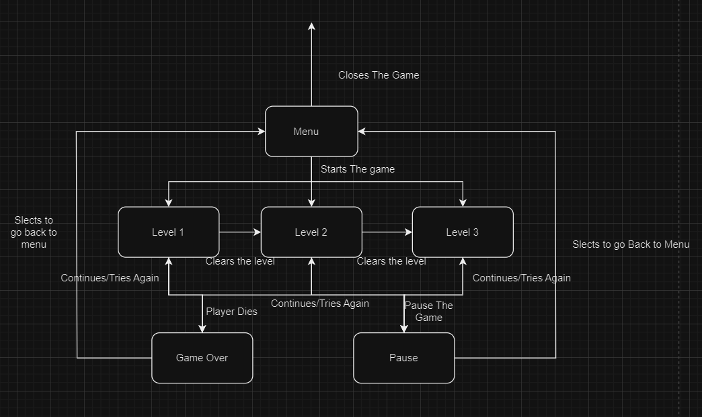
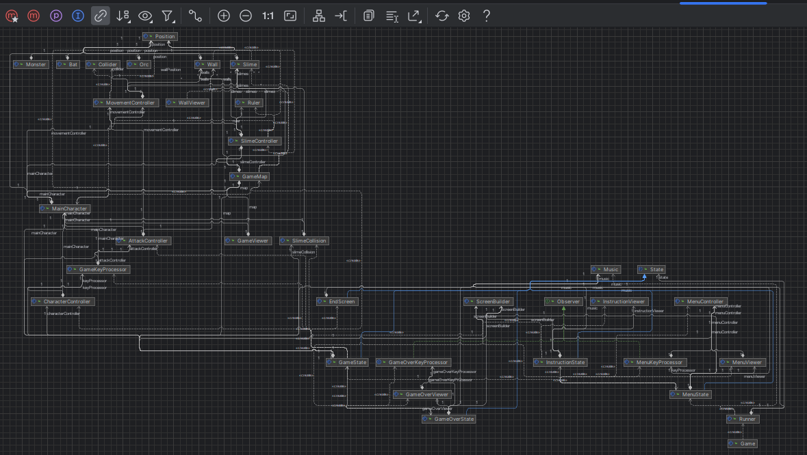
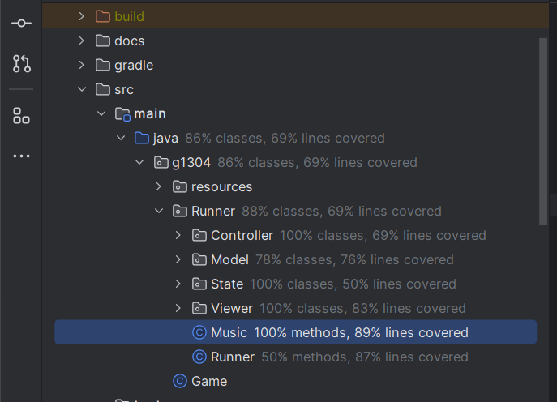
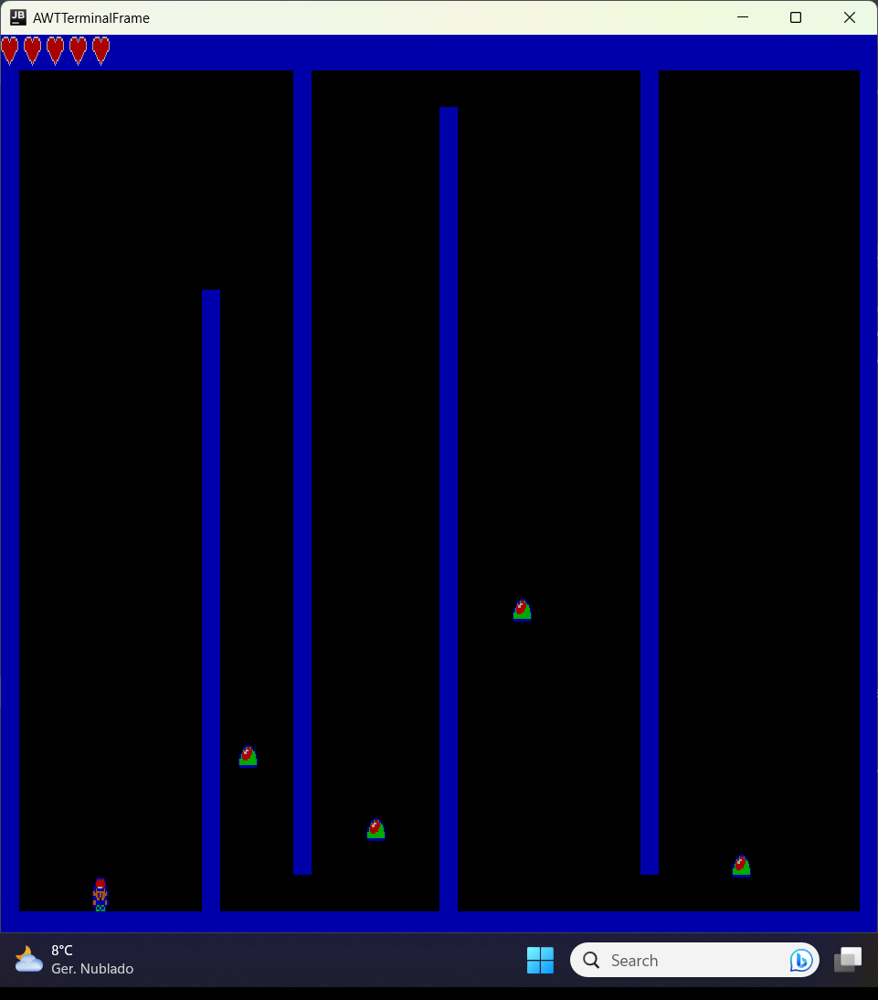
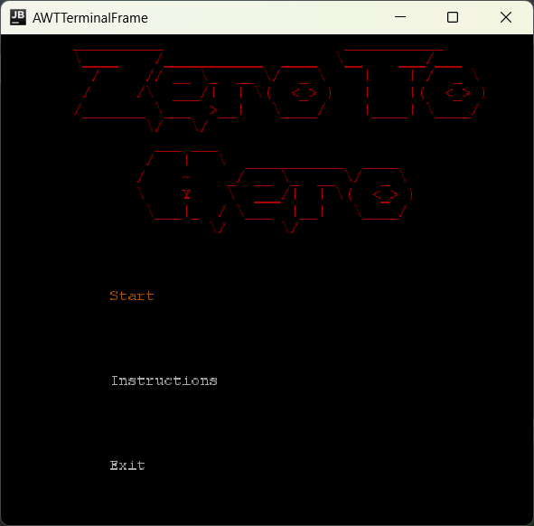

# project-l13gr04 Zero To Hero

## Description
Zero To Hero is a game where you control a wannabe hero that enters a world-famous Dungeon wishing to beat all the monsters inside it. The Dungeon has Three floors that become harder and harder, having more and stronger monsters. Help our hero to become strong and prove his courage and strength against the fierce and evil monsters

## Features

### Implemented Features
* Customized Character Model
* Character Movement
* Character Movement Animations

### Features
* Better Character Movement Animations
* Menu
* Retry The Current Stage
* Monsters
* Monsters Animations
* Combat
* Map
* Instructions
* Collision Detector

## Design Patterns

### Singleton 

#### Problem

An essential part of action game like this is having a hype soundtrack playing during the fierce battle, so we want to implement a class responsible to manage music. There are a bunch of classes that will make use of this class, so in theory we would have to instantiate this class more than once. But, by implementing the Simpleton Pattern we can avoid that.

#### Consequences

Using this pattern, there will only be one object of the class Music that will be shared by all classes that need it, in this case all classes that will have sound like:
* Monster
* Menu
* MainCharacter
* Map

##### Implementation

### Observer

#### Problem

In our project we need a way to make the program a certain way after receiving a key as an input. The solution that we found to that problem is the implementation of the Observer Design Pattern

#### Consequences

Using the Observer pannel all related classes will be obsreving what the user will do and then act based on the user actions.

##### Implementation

### State

#### Problem

Our game is composed by many elements that force our program to act a certain way depending on the action that is beign. To handle that we need to struct our programm in a way that it can change its behaviour according to the situation. We can do that using the State pattern

### Consequences

By coding certain behaviours has states and changing the states when necessary we can make our game having more features as menu, having more than one level, restarting the level, etc

##### Implementation

##### State Diagram

# UML

# Coverage

# Game

# Menu

project-l13gr04 created by GitHub Classroom
